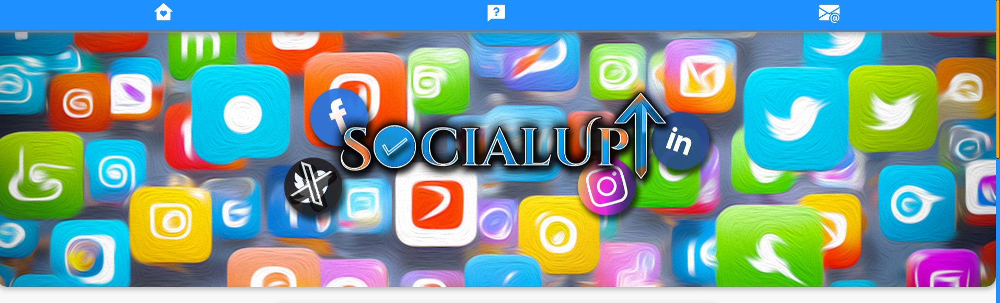
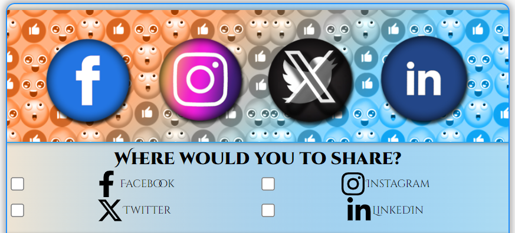
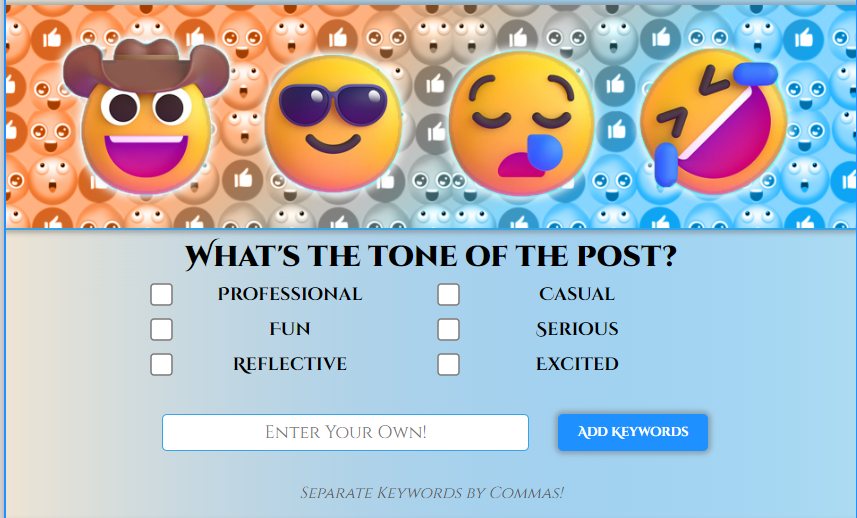
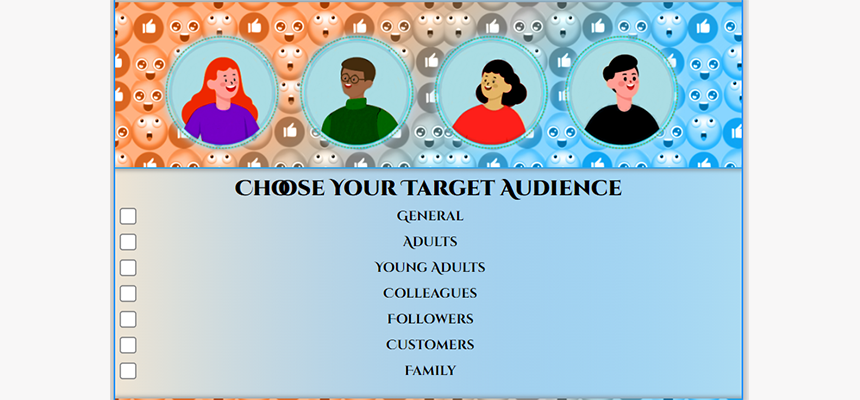
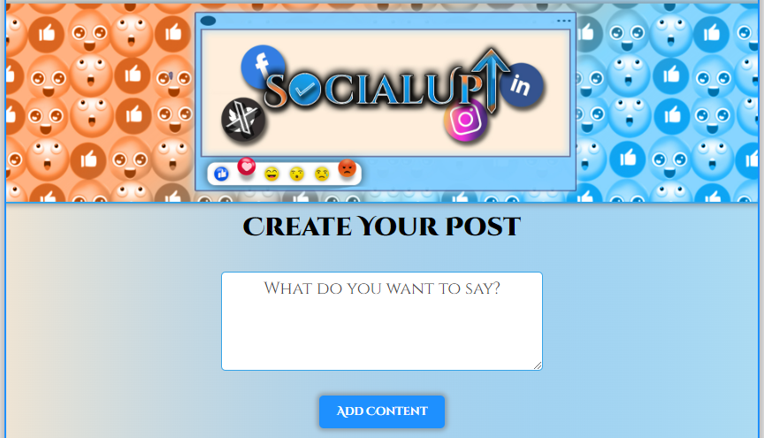
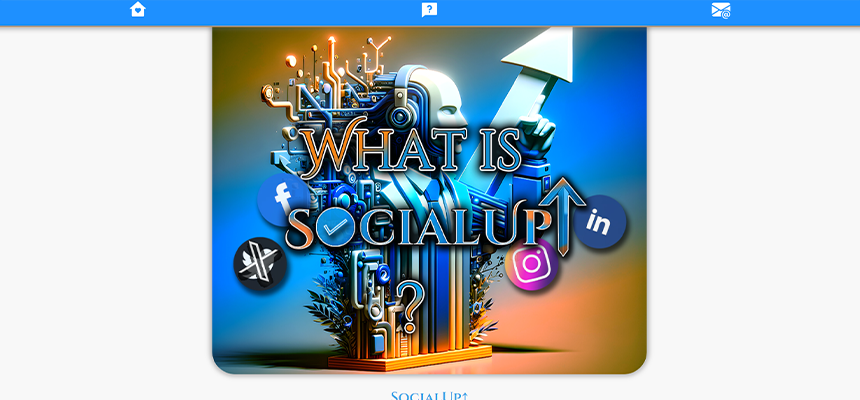
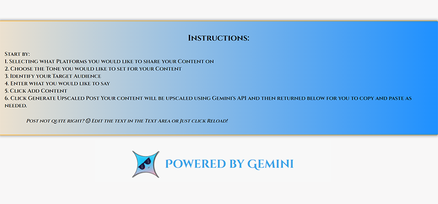
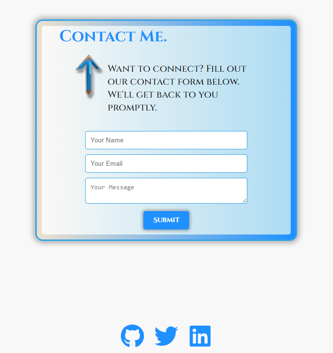
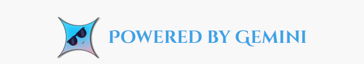

# SocialUp↑

### _Upscale your Social Media content with AI!_


## Description

SocialUp↑ uses the Google's amazing AI Gemini to upscale your Social Media Content. Imagine writing in simple terms exactly what you want to post without having to overthink the audience, the post requirements/limitations, the platform even. That's where we come in. We use Google Gemini as the backbone of our service to transform what you _Want_ to say into what users _Want_ to read!

## Table of Contents

1. [Instructions](#instructions)
1. [Technologies](#technologies)
1. [Screenshot](#screenshot)
1. [Roadmap](#roadmap)
1. [License](#license)
1. [Credits](#credits)
1. [Links](#links)
1. [Contact](#contact)

<a id="instructions"></a>

## Instructions

> _So how does it work?_

Start by:

1. Selecting what Platforms you would like to share your Content on

2. Choose the Tone you would like to set for your Content

3. Identify your Target Audience

4. Enter what you would like to say

5. Click Add Content

6. _then_ Click Generate Upscaled Post

Your content will be upscaled using Gemini's API and then returned below for you to copy and paste as needed.

Post not quite right? ☹ Edit the text in the Text Area or Just click Reload!

[YouTube Walkthrough Video](www.youtube.com)

> Being a Social Media Icon has never been easier, with SocialUp↑

<a id="technologies"></a>

## Technologies

- Gemini API
- React
- FormSpree
- Google Fonts

```
  "dependencies": {
    "@formspree/react": "^2.5.1",
    "@google/generative-ai": "^0.14.1",
    "react": "^18.2.0",
    "react-dom": "^18.2.0",
    "react-icons": "^5.2.1",
    "react-router-dom": "^6.23.1",
    "underscore": "^1.13.6"
  },
```

<a id="license"></a>

## License

[](https://opensource.org/licenses/MIT)

<a id="credits"></a>

## Credits

[Google Gemini](https://gemini.google.com/app)

Used code from this tutorial/my gemini clone:

[GreatStack YouTube](https://www.youtube.com/watch?v=0yboGn8errU)
[My Gemini Clone](https://gemini-ryan.netlify.app/)

<a id="screenshot"></a>

## Screenshot


<details closed>
<summary>See More Screenshots Here!</summary>
<br>



















</details>

<a id="roadmap"></a>

## Roadmap

Future Development Plans:

- Implement a User Login/Profile Page
  - Firebase for Authenticaton and Data Storage
  - Save your favorite posts!
- Return individual results containers based on Platform
- Create auto-post to Platform feature instead of Copy/Paste
  - Utilizing mentioned Firebase Database, store credentials/sign in for popular social media and allow options to post from web app directly!
- Create a Mobile App version using React Native for iOS/Android Apps

<a id="links"></a>

## Links

### [Repo Link](https://github.com/8BitGinger/socialUp)

### [Deployed Link](https://social-up.vercel.app/)

### [My Portfolio](https://ryanfann.netlify.app/)

<div align="center">

<a id="contact"></a>

</div>

## Questions

Contact Me Here:

<div align="center">

#### Email:

ryan.fann@gmail.com

#### GitHub Username:

[8BitGinger](https://github.com/8BitGinger)


</div>
